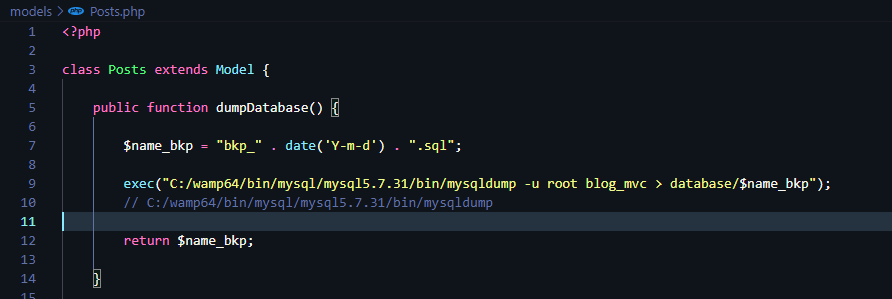
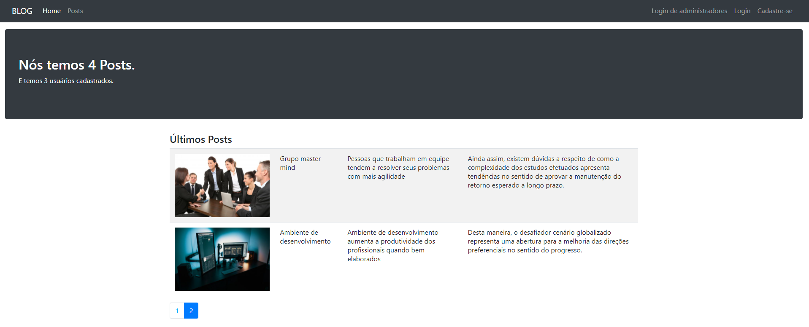
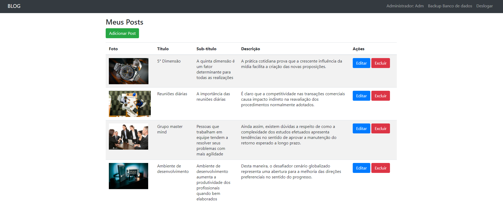

# Sistema de blog

## Arquitetura utilizada: MVC

## Introdução
No sistema elaborado, ao acessar a página inicial podemos ver todos os posts criados por usuários administradores.
<br><br>
Também está disponível as opções de efetuar login com usuários comuns e administrativos, além disso, ainda existe uma opção para efetuar o cadastro de um usuário comum.
<br><br>
A partir do painel administrativo, podemos:
<ul>
    <li>Criar Posts</li>
    <li>Editar Posts</li>
    <li>Deletar Posts</li>
    <li>Adicionar Posts</li>
    <li>Obter um dump da base de dados do sistema</li>
</ul>

<hr>

## Estrutura

 - [core](core)
 - [controllers](controllers)
 - [database](database)
 - [middleware](middleware)
 - [models](models)
 - [views](views)
 - [assets](assets)

### Database
 - Diretório responsável por armazenar o Dump solicitado pelos usuários administradores.
 - O arquivo blog_mvc.sql é o dump original gerado após a conclusão do teste.

<hr>

#### Configurações para instalação do projeto

##### É necessário possuir localmente algum software que emule um Servidor Web que contenha suporte para a linguagem PHP, por exemplo:
- WAMP
- XAMP

##### É necessário possuir o banco de dados mysql/mariadb localmente para fazer a importação do banco de dados utilizado.
- Arquivo para importação do banco de dados: blog_mvc.sql

##### Usuário administrado para acessar o sistema
- Login: admin@hotmail.com
- Senha: teste123 

##### Para solicitar um dump do banco de dados através do painel administrativo será necessário antes, verificar se o comando mysqldump está disponível localmente. Para verificar, basta abrir um terminal e executar o comando mysqldump.

##### Se aparecer a mensagem de comando não encontrado, será necessario fazer o apontamento para o comando mysqldump no arquivo "models/Posts.php" conforme o exemplo abaixo:


##### Página inicial do sistema


##### Página administrativa


## Clonar repositório
1. Clonar este repositório ```git clone https://github.com/Marques-10/BLOG_MVC.git```